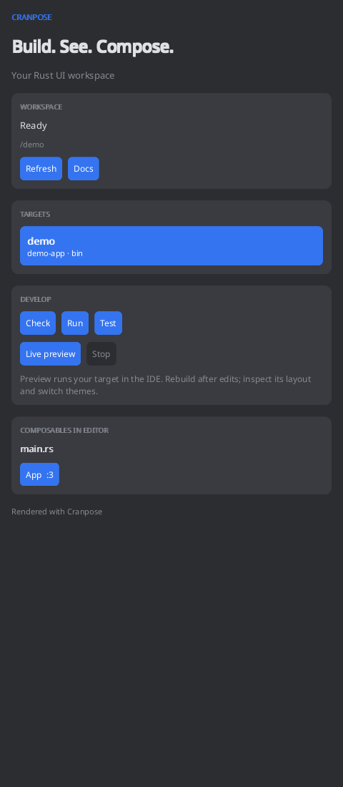

# Cranpose for IntelliJ IDEA

Cranpose development tools for IntelliJ IDEA and RustRover. The tool window itself
is written in Rust with Cranpose.



## What works

- **Workspace targets:** discover Cargo workspace binaries and examples with a direct
  Cranpose dependency, including renamed dependencies and required features.
- **Build and run:** check, run and test the selected target. Compiler diagnostics
  include links to source locations in the Run console. Stop cancels the running command.
- **Interactive previews:** build a target into an IDE tab, interact with it, switch
  light/dark themes, and rebuild automatically when Rust, WGSL or Cargo files are saved.
- **Layout inspection:** capture the preview's current layout tree, render scene and
  screen summary on demand.
- **Editing:** gutter markers for `#[composable]` functions, navigation from the tool
  window, and `cpcomposable`, `cpcolumn`, `cprow`, `cptext`, `cpstate`, `cpbutton` completions.
- **Starter:** create a working counter app in an empty project directory.

Requires IntelliJ IDEA 2026.1+ or RustRover 2026.1+, a working Rust/Cargo toolchain
for project commands, and a Metal, Vulkan or DX12-capable system (software Vulkan
also works). Install JetBrains Rust support in IDEA for Rust parsing, regular code
completion, refactoring and gutter placement. Cargo controls and the tool window
do not depend on the Rust plugin.

## Install and use

Download the `plugin` artifact from a successful [Build](https://github.com/samoylenkodmitry/cranpose-idea/actions/workflows/build.yml)
run. In **Settings → Plugins → gear → Install Plugin from Disk**, select its ZIP.

1. Open the directory containing your workspace's `Cargo.toml`.
2. Open **View → Tool Windows → Cranpose**. Trusted projects load their targets automatically.
3. Select a target, then **Check**, **Run**, **Test**, or **Live preview**.
4. In a preview, use **Inspect** for a snapshot and **Rebuild on save** to control automatic rebuilding.
5. Open a Rust file to navigate its composables from the tool window.

Commands are also available through **Tools → Cranpose** and **Find Action**.

### Preview compatibility

The plugin enables the direct dependency's `embed` feature for previews. Applications
using the framework's automatic embedded launch support can keep their normal
`AppLauncher::run(App)` entry point.

That framework support and inspection were added after 0.1.164 in
[Cranpose #857](https://github.com/samoylenkodmitry/Cranpose/pull/857). The
[sample counter](samples/counter) pins that tested framework revision. The pin can
be replaced by a crates.io version containing those changes after its release.

For older Cranpose versions, dispatch `EmbedEndpoint::from_env()` to
`run_embedded` explicitly. Such applications render
normally but need the newer framework for inspection.

Previews execute the selected binary or example's root UI. They do not generate
entry points for arbitrary functions. Rebuilding restarts the process and resets
its in-memory state. Source navigation recognizes literal or qualified
`#[composable]` attributes; aliases and macro-generated functions are left to
the Rust language plugin.

## Develop

```sh
cargo test --locked --no-default-features -p cranpose-intellij-ui
cargo clippy --locked --no-default-features -p cranpose-intellij-ui --all-targets -- -D warnings
cd plugin
./gradlew test buildPlugin
./gradlew verifyPlugin
./gradlew runIde -PrunIdeProject=/path/to/cargo/project
```

Gradle downloads the configured IDEA and a Java 21 toolchain when needed. Use
`-PplatformLocalPath=/path/to/RustRover.app` for an installed IDE.

The native UI runs separately from the IDE. A crash is contained in that process;
the panel can restart it. Build the UI with `cargo build --no-default-features`,
then pass `-PcranposeUiBinary=/absolute/path/to/target/debug/cranpose-intellij-ui`
to `runIde` for UI binary hot reload.

CI builds native binaries for macOS, Linux and Windows on aarch64 and x86_64,
runs tests with software Vulkan, verifies IDEA/RustRover compatibility, and
bundles one plugin ZIP. Local `buildPlugin` bundles only the current machine's
binary. See [Publishing](docs/publishing.md) for the separate Marketplace step.

## Architecture

- `ui/src/dashboard.rs`: Cranpose-rendered workspace controls and source navigation.
- `plugin/.../CranposeProjectService.kt`: project-scoped Cargo processes and diagnostics.
- `plugin/.../PreviewController.kt`: embedded app lifecycle, themes, save watching and inspection.
- `plugin/.../CranposeEditorSupport.kt`: editor completions and gutter markers.
- The template's socket/session/surface code handles the authenticated native transport.

The inspector captures the primary surface and displays a text report. The
template's current IME, IDE shortcut and screen-reader limitations also apply
to the native panels. Standard editor and Run-console features remain native IDE UI.

## Credits and license

Apache-2.0. Built from the
[Cranpose IntelliJ plugin template](https://github.com/samoylenkodmitry/cranpose-intellij-plugin-template)
and powered by [Cranpose](https://github.com/samoylenkodmitry/Cranpose).

The signing setup and publishing conventions follow Dmitry Samoylenko's
[Zeus Thunderbolt](https://github.com/samoylenkodmitry/Zeus-Thunderbolt-Idea-Plugin)
and [DiffTrack / Branch Lens](https://github.com/samoylenkodmitry/difftrack).
